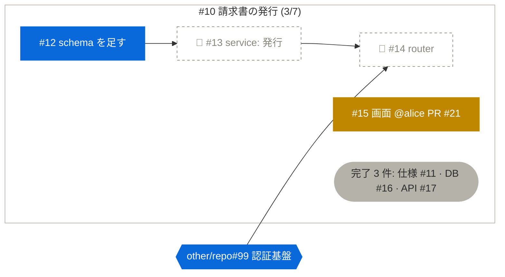

# 依存グラフを図にする

[sequencing-issues](../SKILL.md) の手順 3 で、利用者が依存の可視化を求めたとき、または open の Issue が 8 件を超えて文章では順序を追えないときに使う。図は手順 1 の再取得と手順 2 の分類から描く。図のために Issue を取り直さない（[レート制限](COMMANDS.md#レート制限と報告)）。

図は Mermaid の `flowchart` で書く。ソースは文字なので diff が取れ、Markdown へ貼れる。**ただし Mermaid のコードブロックが図になるのは、描画する面だけである。** 表示環境によってはソースがそのまま出る。会話で見せるときは、[図として見せる](#図として見せる)に従う。

## 図が答える問い

図は「今どこから着手でき、何が何を止めているか」を一目で答える。そのために次を守る。

- **矢印は blocker → blocked の向き**に引く。左から右へ読むと着手順になる（`flowchart LR`）。
- **分類を色で示す。** フロンティアだけを塗りつぶしの強い色にして、最初に目が行くようにする。色は慣用の意味と衝突させない。**緑（成功・完了）と赤（失敗）は使わない。** フロンティアは「まだ何も起きていないが、今着手できる」状態なので、緑にすると済んだと読まれる。青（着手できる）、黄（進行中）、点線で塗らない枠（ブロック）、灰（完了）にする。ブロックの node は、ラベルの先頭に 🚫 を書く。色の見分けにくい人にも伝わり、GitHub の Markdown やインライン表示のどこでも崩れない（アイコンフォントは読み込めない面がある）。
- **親 Issue は `subgraph`** にして、見出しへ進捗（完了数 / 全数）を書く。sub-issue の関係は包含で、blocked-by の関係は矢印で表し、2 種類の辺を混ぜない。
- **完了は 1 つの node へ畳み**、そこから辺は引かない。番号だけでは何が済んだか分からないので、番号に短い題を添える（`完了 3 件: 仕様 #11 · DB #16 · API #17`）。完了した blocker はもう止めていない。open の Issue の間を取り持つ完了だけは、経路が切れないよう個別の node で残す。
- **対象群の外や別 repo の blocker も node にする**（同じ repo の外なら `#番号`、別 repo なら `owner/repo#番号`）。止めている原因が図の外へ消えないようにする。その blocker 自身も分類し、**六角形**（`{{"..."}}`）で描く。区別を色に載せず形に載せるので、フロンティアなら青の六角形になり、「ここから着手すれば先が開く」ことが見える。
- **進行中の node には担当と PR を書く**（`@login PR #21`）。誰の何を待つかが分かる。
- **循環は点線の矢印に `循環` のラベル**を付けて示す。
- node が 30 を超えるなら、親 Issue ごと、またはフロンティアから 2 段先までに分けて複数の図にする。

## 雛形

次の番号・担当・repository は架空の例である。

`style p10 ...` は親の枠で、省くと既定の色が付き node の色分けと紛らわしい。塗りを `none` にしているのは、明るい面でも暗い面でも読めるようにするため。図の下へ凡例を 1 行で添える（青: フロンティア、黄: 進行中、🚫 と点線: ブロック、灰: 完了、六角形: 親の外の Issue）。色だけに頼らず、フロンティアの番号は文章でも列挙する。

## 図として見せる

表示環境が Mermaid を描画するなら、コードブロックで図を表示する。描画を確認できない場合は、利用可能なインライン表示やローカルのレンダラーで図にする。描画できる手段がなければ、フロンティアと blocker を文章または表で示し、図のソースはその旨を明記して添える。

描画後は文字切れ・重なり・凡例の欠けを確認する。外部ライブラリを使う場合は、利用可能な環境とネットワークの制約を確認する。非公開の Issue 本文や図を外部レンダリングサービスへ送るには、その送信の許可が必要である。

## Mermaid の書き方の注意

- node の id は `i<番号>` のように英字で始める。ラベルは必ず `["..."]` で囲む。囲めば `#12`・`@login`・括弧・コロン・日本語はそのまま書ける。
- タイトル中の `"` は `#quot;` へ置き換える。そのまま書くと図全体が parse error で描画されない。
- タイトルは 30 字程度で切る。長いラベルは node を広げ、矢印が読めなくなる。

## 図の置き場所

図は再取得した時点の**キャッシュ**で、依存が 1 本変われば古くなる。

- 既定では会話へ、図にして出す。親 Issue へは貼らない（SKILL.md 手順 5）。
- 利用者が Issue や文書へ貼ると決めたときは、図の直前へ取得時刻と「最新は再取得で得る」旨を 1 行で書く。GitHub の Markdown は `mermaid` のコードブロックを図にする。ただし node の中の `#番号` が自動展開されるかは未確認なので、貼る前に 1 度試す。
