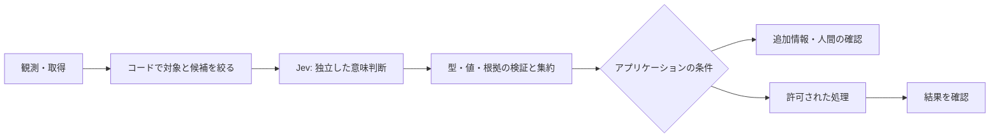

# 効果を得やすい構成と設計の分担

確認日: **2026-09-22**。公式パターンを基にした設計ガイド。どの構成でも速度・精度・費用の改善は対象 workload で確認する。

## 基本構成

コードで通常の処理を組み立て、自然言語の意味判断が必要な箇所へ Jev を入れる。入力を限定し、判断を小さく分け、結果の合成と副作用はコードで制御するのが公式の基本方針。[How to build with TypeSafe](https://docs.typesafe.ai/concepts/how-to-build-with-system-one)。

この図の実行権限・改訂確認・結果検証は、このリポジトリが設計上追加する責務。Jev の出力だけで実行を承認しない。

## 向いている構造

| 構造 | 組み方と効果を得やすい理由 | 公式資料 |
| --- | --- | --- |
| **独立質問の一括評価** | 同じ state について種類・緊急性・不足情報を同時に聞き、必要な回答だけ採用する。state の重複送信と逐次往復を減らせる | [Fan-out](https://docs.typesafe.ai/patterns/fan-out)、[一括質問の実験](https://docs.typesafe.ai/cookbooks/parallel_questions) |
| **確信度に応じた経路分岐** | 意味判断と不確実性を別々に扱い、低確信時は再取得・追加質問・人間へ進める | [Confidence routing](https://docs.typesafe.ai/patterns/confidence-routing) |
| **複数軸の評価と合成** | 明瞭さ・関連性などを別の Score にし、正規化と重み付けをコードで行う。重みだけを変えて再利用できる | [Composite scoring](https://docs.typesafe.ai/patterns/composite-scoring) |
| **担当・処理の振り分け** | 候補を定型処理・専門モデル・人間などに固定し、Choice で入口を分類する | [Intent routing](https://docs.typesafe.ai/patterns/intent-routing) |
| **候補の生成と選択を分ける** | パーサーや検索で候補を列挙し、Jev は文脈に合う候補IDを選ぶ。元の文字列の復元・正規化はコードで行う | [値の抽出](https://docs.typesafe.ai/cookbooks/pre_parsed_value_extraction_cookbook)、[再ランキング](https://docs.typesafe.ai/cookbooks/rerank_typesafe) |
| **大きい分類体系を段階的に辿る** | 各段で限定された子候補を評価し、不確実なら複数の経路を維持する。候補と入力の上限も管理する | [Hierarchical classification](https://docs.typesafe.ai/cookbooks/hierarchical_classification) |
| **生成した内容を別工程で検証する** | 生成モデルの抽出候補や引用を、対応する原文と照合する。検出結果をレビューや再生成に使う | [SDE cascade](https://docs.typesafe.ai/cookbooks/sde_cascade)、[引用確認](https://docs.typesafe.ai/cookbooks/citation_check) |
| **候補選択と適合確認を分ける** | Choice で最良候補を選び、別の問いで「そもそも適切な候補があるか」を確認する。最良と十分を同一視しない | [Skill suggestion](https://docs.typesafe.ai/cookbooks/skill_suggestion) |

一括評価できるのは、同じ入力から独立に答えられる質問。別の state を持つ多数のレコードを単に1リクエストへ詰めることとは異なる。質問が増えるほど費用が完全にゼロになるわけでも、すべての環境で同じ応答時間になるわけでもない。

## 一括と多段を使い分ける

- **一括でよい**: 「不具合報告か」「再現手順を明示しているか」を同じ文章に対して聞く。不具合でなければ後者を使わない。
- **次の呼び出しが必要**: 最初に選んだ文書を外部検索で取得し、その本文に対して質問する。最初の呼び出しには、その文書も回答も存在しない。
- **コードで済む**: 日付の範囲、合計金額、必須フィールド、権限、依存の閉鎖状態を確定する。

回答に依存する質問は、最初の応答を受けて次の state を構成する。同じ `questions` 内で「前の質問の答えを使って」と指示しても依存関係は作れない。[Primitives](https://docs.typesafe.ai/primitives)。

## 質問と state の設計

1. 判断対象を `document.body` などの名前付きフィールドに置き、質問中で対象のパスを明示する。
2. 質問は1つの性質を評価するようにする。用途、例外、候補の境界は `instructions` と `criteria` で一致させる。
3. 最新情報は取得して state に入れる。無関係な履歴を積むより、根拠となる短い箇所・版・候補を残す。
4. Choice の上限と入力長に収まるなら候補全体を渡せる。候補が上限を超える場合や絞り込みに利点がある場合は、決定論的な絞り込みや段階選択を使う。`no_match` が必要な用途では明示的に含める。
5. 段階数が異なる Score を合成する場合は、`score / (criteria.length - 1)` などで尺度を揃えてから重み付けする。正規化しても異なる評価軸の意味が同じになるわけではない。[Composite scoring](https://docs.typesafe.ai/patterns/composite-scoring)。

JSON はラベルと関係を明確にするために使う。ネストを深くすること自体が高精度化ではない。構造化した質問や候補の例は [Advanced: structure](https://docs.typesafe.ai/primitives/advanced)、入力の切り分けは [State](https://docs.typesafe.ai/concepts/state) を参照する。

## このリポジトリに当てはめるなら

以下は設計案で、接続済みサービスやライブ評価の成果ではない。

- Issue の着手判定: GitHub の依存関係をコードで読み、着手可能な集合を確定してから、本文の曖昧さや不足情報を Jev で補助評価する。Jev に blocker を消させない。
- メモリの候補選択: tenant・principal・project・同意・有効期限で絞ってから、意味的な関連性を判断する。検索・保存は外部ストアの役割。
- コードレビュー: AST・diff・呼び出し元から候補を絞り、Jev は確認箇所を分類する。指摘の正否はコードと検査で確かめる。

参照: [architecture](../../../../docs/architecture.md)、[harness](../../../../docs/harness.md)、[cookbook](../../../../docs/cookbook.md)。

## 導入を決める評価

決定論的な処理だけの基準案、既存の生成モデルを使う案、Jev を挟む案を同じ対象で比較する。タスクの正解率だけでなく、誤検出・見逃し・レビュー率・カバレッジ・全体の遅延・再試行込みの費用を見る。ルーブリック、モデル版、候補生成としきい値を固定し、日本語や境界例も別に評価する。

この評価手順は本リポジトリの推奨。詳しくは [evaluation](../../../../docs/evaluation.md)。苦手な構成の切り分けは [LIMITATIONS.md](LIMITATIONS.md)。
