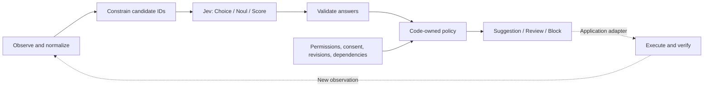

# everything-jev

[](https://github.com/YoshibaTakumu/everything-jev/actions/workflows/ci.yml)
[](LICENSE)

**Use Jev's structured decisions inside automation you can inspect and test.**

[日本語](README.ja.md) · [22 recipes](docs/cookbook.md) · [Architecture](docs/architecture.md) · [Harness integration](docs/harness.md) · [Research sources](docs/sources.md)

[Documentation index](docs/README.md) · [Domain contracts](docs/domain/README.md) · [Tech stack](docs/tech-stack/README.md)

`everything-jev` is an independent TypeScript toolkit and cookbook for [TypeSafe's Jev](https://docs.typesafe.ai/models). It combines an HTTP client, runtime validation, conservative decision policies, and executable examples across development, business operations, and creative tools. Zero runtime dependencies.

The name describes the breadth of the cookbook. **This release ships decision recipes, not 22 connected service integrations.** Live inference requires a TypeSafe API key. Every bundled demo works offline with explicitly labelled, hand-authored responses. Those demos test application wiring, not Jev accuracy.

## Run it

Requires Node.js 24.x and pnpm 12.5.1. CI uses Node 24 from `.node-version`. Install the declared pnpm version using your preferred package-manager setup.

```sh
git clone https://github.com/YoshibaTakumu/everything-jev.git
cd everything-jev
pnpm install --frozen-lockfile
pnpm hooks:install
pnpm build
pnpm jev list
pnpm jev demo contact-filter
pnpm jev demo all
pnpm verify
```

Development uses TypeScript 7, Biome for formatting, oxlint for linting, and Vitest 5 for tests. Lefthook runs local Git checks, and commitlint enforces Conventional Commits locally and in CI. `pnpm verify` checks formatting, lint, compilation, and tests. See [contributing](CONTRIBUTING.md) for details.

The contact-filter demo prints a recommendation like this, alongside its fixture response:

```json
{
  "status": "suggested",
  "recommendation": "unsolicited_sales",
  "reasons": [
    "illustrative_policy_passed",
    "external_execution_not_implemented"
  ],
  "executed": false
}
```

It does not delete a contact or send a message. Gates in this demo are synthetic. A real application must obtain gate values from its authenticated systems.

## Try live inference

First inspect the exact request. Configure `TYPESAFE_API_KEY` securely in your environment, then explicitly opt into a network call:

```sh
pnpm jev inspect contact-filter
pnpm jev evaluate contact-filter --input examples/contact.json --live
```

`--input` replaces the recipe's sample **state**; it does not replace the rubric or candidate IDs. The entire state is sent to `api.typesafe.ai`. Use fictional or approved data. The CLI does not load `.env` automatically; see [client behavior](docs/api.md).

Live CLI output includes validated answers and a `review` decision because platform permissions and other gates are unverified. No API key is needed for tests. The release's automated checks use simulated HTTP responses; **live model quality and third-party integrations have not been validated by this project**. No npm package is published in this release; use this repository.

## The architecture



Jev supplies a narrow semantic judgment. Application code supplies authority, state transitions, persistence, tools, and verification. Confidence is a property of the model's distribution, not proof that an action is correct or authorized. [Official confidence explanation](https://docs.typesafe.ai/confidence).

## What's included

| Component                       | In v0.1.0                                                                                                             |
| ------------------------------- | --------------------------------------------------------------------------------------------------------------------- |
| Jev HTTP client                 | Typed requests, timeout/cancellation, response size limits, sanitized errors; protocol tests with simulated transport |
| Runtime validators              | Choice/Noul/Score, exact answer/candidate maps, probability and score consistency                                     |
| Decision policy                 | `suggested`, `review`, `blocked`; external facts required; never executes tools                                       |
| 22 recipes                      | Runnable requests, fictional state, response fixtures, gates, integration notes                                       |
| Issue sequencing                | Deterministic dependency frontier with invalid-graph rejection                                                        |
| Memory eligibility              | Exact tenant/principal/project filtering, consent, provenance and expiration                                          |
| Evaluation utilities            | Confusion counts, coverage, review rate, precision and recall                                                         |
| Service connectors, storage, UI | Integration designs only; not shipped                                                                                 |

Use the library after building:

```js
import { JevClient, getRecipe, requestFor, decide } from "./dist/index.js";

const recipe = getRecipe("contact-filter");
const request = requestFor(recipe, {
  message: "My export keeps failing. Can you help?",
  customerContext: "Fictional example",
});
const client = new JevClient({ apiKey: process.env.TYPESAFE_API_KEY });
const response = await client.evaluate(request);

// Obtain these facts from your own server. Missing facts require review.
const gates = {};
const result = decide(request, response, gates, {
  requiredGates: recipe.gates,
});
console.log(result); // review; executed: false
```

For offline dependency scheduling, run `node examples/harness.mjs` after building.

## Choose a recipe

| Area                      | Recipe IDs                                                                                         |
| ------------------------- | -------------------------------------------------------------------------------------------------- |
| Development               | `harness-routing`, `semantic-lint`, `code-review`, `security`, `agent-manager`, `issue-sequencing` |
| Knowledge and interaction | `note-tagging`, `memory`, `browser-target`, `typing-game`, `desktop-target`, `voice-routing`       |
| Business operations       | `seo-aieo`, `line-replies`, `email-marketing`, `contact-filter`, `accounting`, `legal-review`      |
| Documents and media       | `google-docs`, `powerpoint`, `slides-as-code`, `video-editing`                                     |

Read the [cookbook](docs/cookbook.md) for each recipe's data flow, limitations and external adapter requirements. The model is not a database, general code generator, speech synthesizer, renderer, authorization service, or legal/accounting authority.

## Adopt and contribute

Start with [architecture](docs/architecture.md), [evaluation](docs/evaluation.md), and [security and privacy](docs/security.md). Then follow the [harness integration guide](docs/harness.md). Thresholds are illustrative and must be calibrated against labelled data from your own domain and language.

Contributions are welcome: stronger examples, adapter implementations, documented evaluation datasets, and failure cases. See [CONTRIBUTING.md](CONTRIBUTING.md), [CODE_OF_CONDUCT.md](CODE_OF_CONDUCT.md), and [SECURITY.md](SECURITY.md).

MIT licensed. This project is not affiliated with or endorsed by TypeSafe, Jev, or the services discussed in the cookbook. Upstream projects and documentation retain their own licenses and trademarks; links acknowledge research, not bundled implementations.
